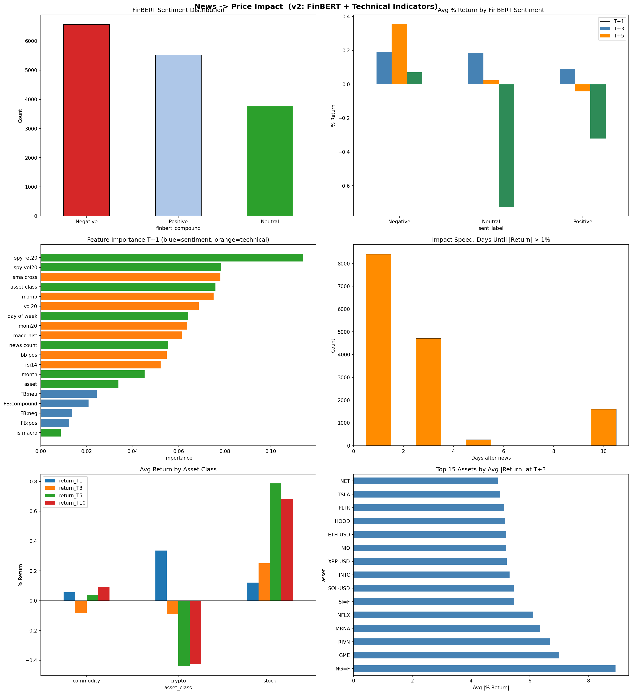

# News → Price Impact ML Model  (v2)


Measures **how much** and **how fast** Yahoo Finance news articles affect the closing prices of stocks, commodities, and cryptocurrencies.

## What it does

1. **Fetches news** from GDELT — 2 years of articles published on `finance.yahoo.com`
2. **Scores sentiment** with **FinBERT** (financial-domain BERT, positive/neutral/negative probabilities)
3. **Computes technical indicators** per asset: RSI-14, MACD, Bollinger Band position, momentum, volatility, SMA crossover, SPY market regime
4. **Maps each news article** to relevant assets via keyword matching (50 stocks, 10 commodities, 5 cryptos)
5. **Computes price impact** at T+1, T+3, T+5, T+10 trading days after each article
6. **Trains XGBoost models** with cross-validation, early stopping, and regularisation
7. **`predict_headline()`** — give it any new headline and asset, get instant predictions

## Results (v2 with FinBERT + technicals)

| Horizon | Avg Error | CV R² | Direction Accuracy |
|---------|-----------|-------|--------------------|
| T+1 day | ±1.5% | — | ~58% |
| T+3 days | ±2.9% | — | ~58% |
| T+5 days | ±4.2% | — | ~62% |
| T+10 days | ±4.9% | — | ~62% |



## Assets covered

**Stocks:** NVDA, TSLA, AAPL, AMD, AMZN, META, MSFT, GOOGL, PLTR, INTC, BABA, JPM, BAC, GS, MS, V, MA, NFLX, DIS, COIN, HOOD, SPY, QQQ, and more

**Commodities:** Crude Oil, Brent, Natural Gas, Gold, Silver, Corn, Soybeans, Wheat, Copper, Coffee

**Crypto:** BTC, ETH, SOL, XRP, USDT

## Setup

```bash
pip install -r requirements.txt
```

## Usage

### Step 1 — Fetch news from GDELT
```bash
python gdelt_yahoo_finance.py
```
Outputs `gdelt_yahoo_finance.csv` (~14k articles, 2024–2026).

### Step 2 — Run the ML pipeline (v2 — recommended)
```bash
python news_price_impact_v2.py
```
Requires:
- `gdelt_yahoo_finance.csv` (from Step 1)
- `Market_Data_5Years.xlsx` (your market data file with Stocks / Commodities / Crypto sheets)

Outputs:
- `news_price_impact_results.csv` — every news event + price change at each horizon
- `asset_impact_summary.csv` — per-asset averages
- `model_performance.csv` — ML model metrics
- `news_price_impact_charts.png` — visualizations

## How it works

```
GDELT API → News titles + dates
                ↓
     FinBERT → pos / neg / neu probabilities
                ↓
    Keyword matching → asset ticker(s)
                ↓                         ↓
 Technical indicators              News volume burst
 (RSI, MACD, BB, momentum,        (articles/day per asset)
  volatility, SPY regime)
                ↓
    Price change at T+1, T+3, T+5, T+10
                ↓
    XGBoost Regressor  →  predicted % change  (CV + early stopping)
    XGBoost Classifier →  UP / FLAT / DOWN
                ↓
    predict_headline("...", "NVDA") → instant prediction
```

### Real-time prediction example
```python
from news_price_impact_v2 import predict_headline

predict_headline(
    headline="Federal Reserve raises interest rates by 25 basis points",
    asset="SPY",
    date="2026-02-28"
)
```

## Data sources

- **News:** [GDELT Project](https://www.gdeltproject.org/) via Doc API
- **Prices:** Yahoo Finance (adjusted close prices)
